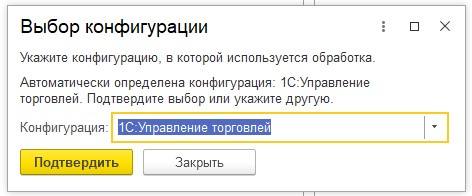
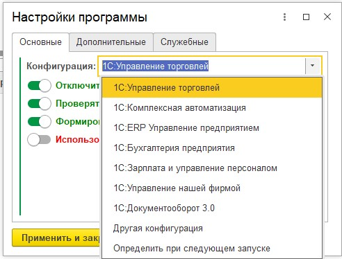
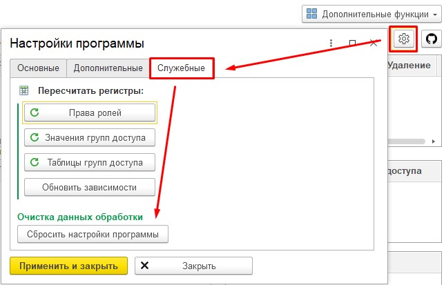

# История изменений

## 4.7 (2026-06-15)

### Новое

- ✅ **Выбор конфигурации** — при первом запуске обработка предлагает подтвердить автоматически определённую конфигурацию или указать другую. Тот же выбор доступен в **«Настройках программы»**. В списке уже перечислены УТ, КА, ERP, БП, ЗУП, УНФ, Документооборот 3.0 и «Другая конфигурация»; в текущем обновлении — это **задел на будущее**: наличие конфигурации в списке **не означает**, что обработка уже полностью с ней работает; поддержка будет добавляться и расширяться в следующих версиях.

- ✅ **Сброс настроек программы** — можно привести все настройки программы к значениям по умолчанию (будет снова предложен выбор конфигурации).

### Исправлено

- ✅ **Сравнение ролей** — снова работает с главной формы и из формы «Копирование / Сравнение».
- ✅ **Очистка пользовательских настроек** — в разделе управления настройками пользователя.

### Техническое

- Новая форма **«Конфигурация информационной базы»** (`ФормаВыборКонфигурации`).
- Передача `ИмяКонфигурации` между главной формой, настройками и формой сравнения/копирования.
- Исходники: каталог `src/AccessControl/` (без суффикса версии в имени папки).
- Версия обработки и регистрационные данные: **v4.7**.
- Скриншоты: `docs/images/v4.7/`.

## 4.6

### Новое

- ✅ **Дополнено дерево метаданных** — при открытии обработки дерево строится по **всем** объектам конфигурации с соответствующими иконками.
- ✅ **Поиск по метаданным** — поле над деревом конфигурации: вводите имя или синоним объекта, список сужается **по мере набора** (Enter теперь не нужен). Дерево автоматически фильтруется и разворачивается по найденным веткам — так же быстро и привычно, как поиск роли в поле «Выберите роль».
- ✅ **Ограничения доступа** — секция под таблицей ролей показывает **все** виды и значения ограничений группы (не только «Пользователи» и «Организации»). При выборе роли автоматически подгружаются группы, виды доступа и их значения.
- ✅ **Проверка обновлений** — при открытии обработки сравнивается её версия с последним релизом на GitHub; справа от номера версии показывается статус (актуальная / доступно обновление / нет связи). Проверку можно отключить в **Настройках**.

- ✅ **Отчёты по ролям** — единая форма с двумя аналитическими разделами: «Роли без пользователей» и «Роли вне профилей». Сводные метрики (найдено / всего / доля), отборы по объектам метаданных и профилям, детальный просмотр карточек ролей, кликабельные метки с расшифровкой списков.

Подробнее — в разделе [Отчёты по ролям](README.md#отчёты-по-ролям) документации.

### Исправлено

- Ошибки при фильтрации дерева (некорректные ключи структуры, обращение к удалённым строкам дерева).
- Сброс текста в поле поиска после обновления дерева с сервера.
- Секция «Ограничения доступа» почти всегда была пустой: значения показывались только для видов «Пользователи» и «Организации»; исправлена привязка значений к виду доступа и запись шаблона ограничений.
- Ошибки при листании ролей: недоступный на клиенте конструктор `ХранилищеЗначения`, отсутствующая картинка `ЭлементСправочника` в библиотеке платформы.

### Техническое

- Переработан алгоритм отбора дерева: однопроходная фильтрация вместо полного копирования с последующим удалением строк.
- Debounce 0,3 с перед серверным запросом при наборе текста.
- Ограничения доступа: связь видов и значений по UUID ссылки (`КлючВидаДоступа`), хранение ссылки вида доступа в колонке формы вместо `ValueStorage`.
- Исходники переименованы в `src/AccessControl.v4.6_unlimited/` (ранее `v4.4_unlimited` — имя зафиксировалось при open-source релизе 4.4 и не менялось при сборках 4.5/4.6).
- Версия обработки и регистрационные данные: **v4.6**.
- Скриншоты отчётов: `docs/images/v4.6/role-reports/`.

## 4.5 (2026-05-31)

### Новое

- ✅ **Поиск роли** в поле «Выберите роль» — вводите имя или синоним, список сужается при наборе; выбор из выпадающего списка.

- ✅ **Сравнение ролей с главной формы** — для ролей, у которых есть права на выбранный объект метаданных.

Чтобы сравнить **любые** роли конфигурации без привязки к объекту: **«Копирование / Сравнение / Настройки»** → вкладка **«Сравнение ролей»** → выбор ролей → **«Сравнить»** (подробнее в разделе [Сравнение ролей](README.md#сравнение-ролей) документации).

- ✅ Open-source сборка без ограничения «пробного периода».

### Исправлено

- ✅ Исправления разбора журнала и совместимости с конфигурациями без константы Telegram (был вариант обработки в расширении).
- Удалены проверки «пробного периода» (ограничение не применяется к open-source сборке).
- Убрана неработающая заглушка `ОшибкаУжеОбработана()` при разборе журнала регистрации (дедупликация по-прежнему выполняется через `ИсправленныеОшибки` и `ОбъектУжеИзвестен`).
- Константа `УД_ТипОшибокДляУведомленийОбОшибках_tg` читается безопасно: если её нет в конфигурации, используются значения по умолчанию.
- Команда настроек Telegram: понятное сообщение, если отдельная форма уведомлений не подключена в конфигурации.

### Техническое

- Версия обработки отображается как **v4.5**; регистрационные данные дополнительной обработки обновлены.
- Исходники: `src/AccessControl.v4.4_unlimited/` (сборка **v4.5**).
- Удалена отладочная строка в модуле сравнения ролей метаданных.

## 4.4

- Публикация open-source версии (unlimited), исходники на GitHub.

## 4.1

### Новое

- ✅ Добавлен парсер запросов. Полезная функция, когда у пользователя не выполняется запрос, и далеко не очевидно, на какую таблицу у него нет прав. Парсер позволит проанализировать таблицы, к которым запрос может обращаться, и сразу отобразит, есть ли у пользователя данное право. По умолчанию используется упрощённый режим для вывода прав «Чтение» (для отчётов) и «Просмотр» (для проблем с динамическими списками).

При отключении упрощённого режима открываются детальные настройки по отображению необходимых прав доступа для каждого объекта метаданных.

- ✅ Добавлена проверка дополнительных прав в анализе связей объекта.

- ✅ Изменена форма справки.

### Исправлено

- ✅ Исправлены найденные ошибки.
